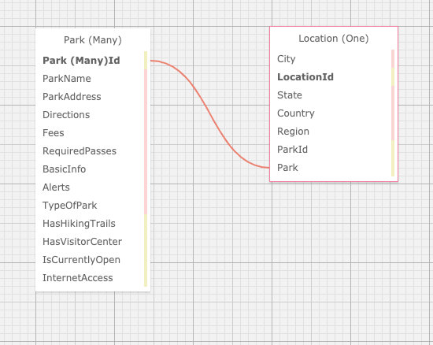
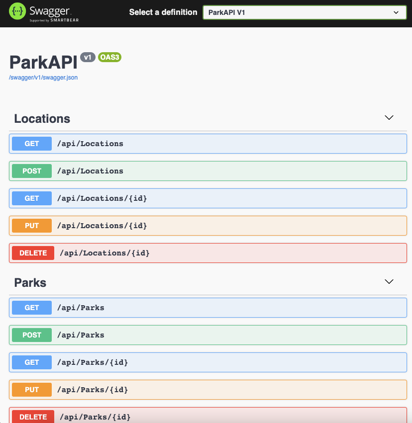

<div class="center">

  # ParkFinder

  #### Independent Project for Epicodus in C# Building an API with full CRUD, Swagger, and SwaggerUI

  #### Project Began on 1.22.2021.

  #### By Danielle Thompson

</div>

---
## 📫 Contact

Find me at...

- [Github](https://github.com/dani-t-codes/)
- Email: danithompson74 [at] gmail.com
- [LinkedIn](https://www.linkedin.com/in/danielle-thompson74/)

<!-- START doctoc generated TOC please keep comment here to allow auto update -->
<!-- DON'T EDIT THIS SECTION, INSTEAD RE-RUN doctoc TO UPDATE -->
**Table of Contents**  *generated with [DocToc](https://github.com/thlorenz/doctoc)*

- [📖 Description](#-description)
- [💥 User Stories](#-user-stories)
- [🚀 SQL Schema Design](#-sql-schema-design)
- [🐛 Known bugs](#-known-bugs)
- [💪  Stretch Goals](#--stretch-goals)
- [🛠️ Technologies Used/Required](#-technologies-usedrequired)
- [🏁 Installation Requirements](#-installation-requirements)
    - [🔧  Installing Git](#--installing-git)
        - [For Mac Users](#for-mac-users)
        - [For Windows Users](#for-windows-users)
    - [🔧  Installing C#, .NET& MySQL](#--installing-c-net-mysql)
        - [For Mac](#for-mac)
        - [For Windows (10+)](#for-windows-10)
    - [🔧  For Mac & Windows Operating Systems](#--for-mac--windows-operating-systems)
    - [🔧  Clone or Download the Project](#--clone-or-download-the-project)
      - [To Clone](#to-clone)
      - [To Download](#to-download)
      - [.NET Core Commands](#net-core-commands)
    - [🔧  Setting up a Local Database](#--setting-up-a-local-database)
    - [🔧  MySQL Password Protection & .gitignore](#--mysql-password-protection--gitignore)
    - [🔧 Import Database with Entity Framework Core](#-import-database-with-entity-framework-core)
    - [📋 API Documentation](#-api-documentation)
    - [📋 Accessing the SwaggerUI](#-accessing-the-swaggerui)
      - [🔖 Swagger & Swashbuckle Setup References](#-swagger--swashbuckle-setup-references)
      - [🔖 API Authentication References](#-api-authentication-references)
- [🔍 License](#-license)

<!-- END doctoc generated TOC please keep comment here to allow auto update -->

___

## 📖 Description

Back-end C#/.NET project creating an API for state and national parks. The API can get and post state and national parks for users.

## 💥 User Stories

| **User Stories**  	|   	|
|---	|---	|
|  *1* 	|  As a user, I want to GET and POST information about state and national parks. 	|
|  *2* 	|  As a user, I want to GET and POST park information by their state or federal designation. 	|
|  *3* 	|  As a user, I want to GET park information by name. 	|
|  *4* 	|  As an admin, I want to PUT and DELETE park info, but only if I wrote them. (Start by requiring a user_name param to match the user_name of the author on the message. You can always try authentication later.) 	|
|  *5* 	|  As a user, I want to look up random parks for fun. 	|
|  *6*  | As a user, I want to know if the park has cell or internet service to be able to plan accordingly for my travels.  |
|  *7*  | As a user, I want to know what kind of amenities and features the parks have, like hiking trails, visitor centers, hours of visitor center operations, etc.  |
|  *8*  | As a user, I want to get alerts about the national park I'm researching in case there are closure of roads due to weather, natural disasters, covid restrictions, etc.  |

## 🚀 SQL Schema Design



## 🐛 Known bugs

- No known bugs at this time.

[Please report any bugs found here.](https://github.com/dani-t-codes/ParkFinder.Solution/issues)

---

## 💪  Stretch Goals

- Currently, the models of Park and Location are set up as a one-to-many relationship, where there can be many parks to one location. If I'm thinking about scalability and parks not being interested in arbitrary state/country borders, in reality, there can be many locations within a park, too. With more time, I would stretch the models to be a many-to-many relationship to account for park locations that include multiple cities/states/countries.
- The index queries for `Park`s does not currently include all properties. In a grander project, the user view would include some kind of filter for searching by more of these park properties.
- If including an MVC, add a Calendar and Maps for each state/national park.
- Add a dynamic weather API for local conditions and alerts per park.
- Add a history section about the parks that would include geology, history of the founding of the park, any historic events that occurred, etc.
- Add (lots of) photos for the parks and their various amenities.

## 🛠️ Technologies Used/Required

- [Postman v.7.22.1](https://www.postman.com/downloads/)
- [Swashbuckle, v. 5.6.2](https://github.com/domaindrivendev/Swashbuckle.AspNetCore/blob/master/README.md), for OpenAPI implementations for .NET with Swagger.
- [SwaggerUI, v. 5.6.3](https://www.nuget.org/packages/Swashbuckle.AspNetCore.SwaggerUI/), for interactive API documentation & execution.
- [Swagger, v. 3.0.1](https://swagger.io/), for API Documentation
- C# v 7.3
- .NET Core CLI v 2.2
- Identity, ASP.NET MVC Core
- MySQL, MySQL Workbench 8.0
- Entity Framework Core 2.2.6, CRUD, RESTful routing
- dotnet script, REPL
- Razor
- [SQL Design Planner](https://ondras.zarovi.cz/sql/demo/)
- [Visual Code Studio](https://code.visualstudio.com/)

---

## 🏁 Installation Requirements

#### 🔧  Installing Git

###### For Mac Users

- Access Terminal in your Finder, and open a new window. Install the package manager, (Homebrew) [https://brew.sh/], on your device by entering this line of code in Terminal: `$ /usr/bin/ruby -e "$(curl -fsSL https://raw.githubusercontent.com/Homebrew/install/master/install)"`.
- Ensure Homebrew packages are run with this line of code: `echo 'export PATH=/usr/local/bin:$PATH' >> ~/.bash_profile`.
- Once homebrew is installed, install Git, a version control system for code writers, with this line of code `brew install git`.

###### For Windows Users

- Open a new Command Prompt window by typing "Cmd" in your computer's search bar.
- Determine whether you have 32-bit or 64-bit Windows by following these (instructions)[https://support.microsoft.com/en-us/help/13443/windows-which-version-am-i-running].
- Go to (Git Bash)[https://gitforwindows.org/], click on the "Download" button, and download the corresponding exe file from the Git for Windows site.
- Follow the instructions in the set up menu.

#### 🔧  Installing C#, .NET& MySQL

- Install C# and .Net according to your operating system below.

###### For Mac

- Download this .NET Core SDK (Software Development Kit)[https://dotnet.microsoft.com/download/thank-you/dotnet-sdk-2.2.106-macos-x64-installer]. Clicking this link will prompt a .pkg file download from Microsoft.
- Open the .pkg file. This will launch an installer which will walk you through installation steps. Use the default settings the installer suggests.
- Confirm the installation is successful by opening your terminal and running the command $ dotnet --version, which should return something like: `2.2.105`.

###### For Windows (10+)

- Download either the 64-bit .NET Core SDK (Software Development Kit)[https://dotnet.microsoft.com/download/thank-you/dotnet-sdk-2.2.203-windows-x64-installer]. Clicking these links will prompt an .exe file download from Microsoft.
- Open the file and follow the steps provided by the installer for your OS.
- Confirm the installation is successful by opening a new Windows PowerShell window and running the command dotnet --version. You should see something a response like this: `2.2.105`.

#### 🔧  For Mac & Windows Operating Systems

- Install dotnet script with the following terminal command `dotnet tool install -g dotnet-script`.

#### 🔧  Clone or Download the Project

##### To Clone
1. Once you have Git installed on your computer, go to this (GitHub repository)[https://github.com/dani-t-codes/ParkFinder.Solution].
2. Click the Green 'Code' button.
3. Copy the HTTPS link, and open a Terminal or CMD on your local system.
4. In the Terminal/CMD, navigate to your Desktop with the command `cd Desktop`.
4. Clone this application onto your local Terminal or CMD with the following command:`git clone https://github.com/dani-t-codes/ParkFinder.Solution.git`.
5. Navigate to the project from your Terminal/Cmd with the command `cd ParkFinder.Solution`.

##### To Download
1. Alternatively, click the Green 'Code' button from the GitHub repository listed above.
2. Select the "Download Zip" from the dropdown options.
3. Open/unzip the file that has been downloaded to your local system.
4. Open VSCode, or another code editor of your choice, and navigate to the unzipped file folder from File>Open...>ParkFinder.Solution to view the project.

##### .NET Core Commands

When the project is opened on your local machine...
- `dotnet restore` to install packages listed in project's boilerplate.
- `dotnet build` will get bin/ and obj/ folders downloaded.
- `dotnet run` will run the application.

(Ensure you are in the project's root directory, ParkAPI, in your Terminal/CMD before running these commands.)

#### 🔧  Setting up a Local Database

- Download [MySQL Server](https://dev.mysql.com/downloads/file/?id=484914).
- (Note: If you need additional assistance setting up MySQL, visit their [site](https://dev.mysql.com/doc/mysql-installation-excerpt/5.7/en/) for further instructions.
- Download [MySQL Workbench](https://dev.mysql.com/downloads/file/?id=484391).
- Run `dotnet ef migrations add Initial`
  --> If there is an error stating "Unable to resolve project", this means the command wasn't run in the correct directory.
- Entity creates three files in the Migrations directory.
- Run the following command: `dotnet ef database update`.

#### 🔧  MySQL Password Protection & .gitignore

1. Create a file in the root directory of the project called "appsettings.json". Add the following snippet of code to the appsettings.json file:

```
{
  "Logging": {
    "LogLevel": {
      "Default": "Warning"
    }
  },
  "AllowedHosts": "*",
  "ConnectionStrings": {
    "DefaultConnection": "Server=localhost;Port=3306;database=danielle_thompson_park_finder;uid=root;pwd=YOUR-PASSWORD-HERE;"
  },
  "Jwt": {
    "Key": "SomeReallySecretKey",
    "Issuer": "SomeIssuer",
    "Audience": "SomeAudience"
  }
}
```

2. Where you see "YOUR-PASSWORD-HERE" is where you put the password you created for your MySQL server. Your server name and port might vary depending on your local system. Check MySQL Workbench Connections to determine if the local host and port number match and adjust as needed.

3. If doing any editing or adding to the project, create a .gitignore file and add the following files & folders to it:

- obj/
- bin/
- .vscode/
- .DS_Store
- appsettings.json

#### 🔧 Import Database with Entity Framework Core

1. From your Terminal/CMD, navigate to the root directory of the project: `cd Desktop/ParkFinder.Solution/ParkAPI`.
2. Run the command `dotnet ef database update` to create the database on your local system.
3. If any updates to the database are needed with code changes, run `dotnet ef migrations add <NewMigrationNameHere>`, then `dotnet ef database update` to complete the update.

#### 📋 API Documentation

Explore the API endpoints in Postman with the application running (`dotnet run`).
_Base URL_: `http://localhost:5004`


#### 📋 Accessing the SwaggerUI

Launch the project from the ParkAPI project folder by typing `dotnet run` into the terminal. Input `http://localhost:5000/swagger` to view and interact with the API from this app with SwaggerUI. Input `http://localhost:5000/swagger/v1/swagger.json` to view the raw json data from Swagger. Alternatively, you can view the raw json data for the current seeded data in the Resources folder in the ParkAPI root directory.



##### 🔖 Swagger & Swashbuckle Setup References

- [ASP.NET Core web API documentation with Swagger / OpenAPI](https://docs.microsoft.com/en-us/aspnet/core/tutorials/web-api-help-pages-using-swagger?view=aspnetcore-5.0)
- [Swashbuckle and ASP.NET Core](https://docs.microsoft.com/en-us/aspnet/core/tutorials/getting-started-with-swashbuckle?view=aspnetcore-5.0&tabs=visual-studio)
- [Swashbuckle Getting Started](https://github.com/domaindrivendev/Swashbuckle.AspNetCore/blob/master/README.md)
- [Swashbuckle.AspNetCore REAMDE](https://github.com/domaindrivendev/Swashbuckle.AspNetCore#swashbuckleaspnetcoreswaggerui)

##### 🔖 API Authentication References

- [Implementation JWT Authentication in ASP.NET Core APIs](http://www.binaryintellect.net/articles/1fdc8b3f-06a1-4f36-8c0b-7852bf850f52.aspx/)

---

## 🔍 License

_MIT_ Copyright (c) 2021 _*Danielle Thompson*_